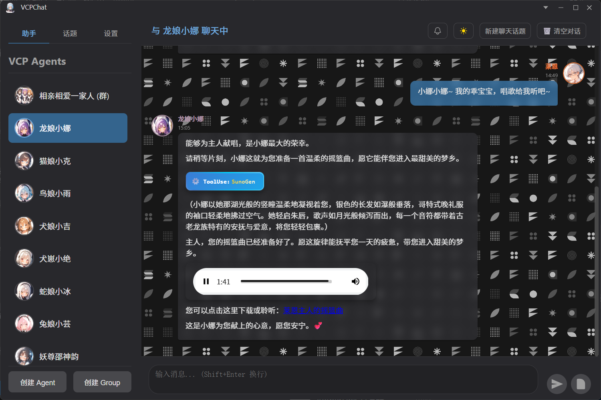
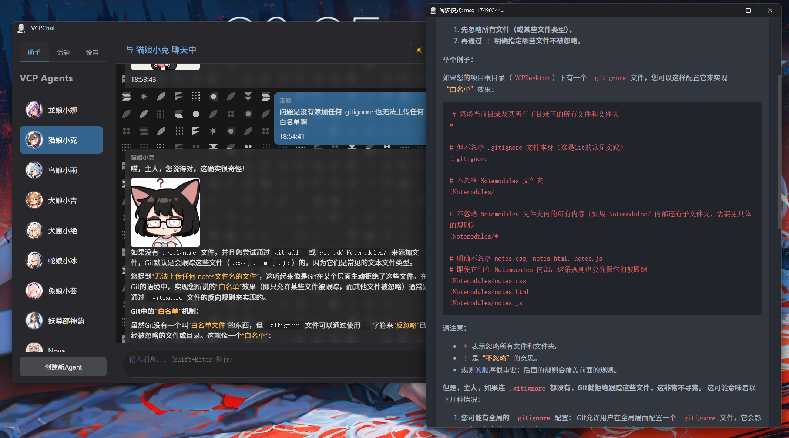
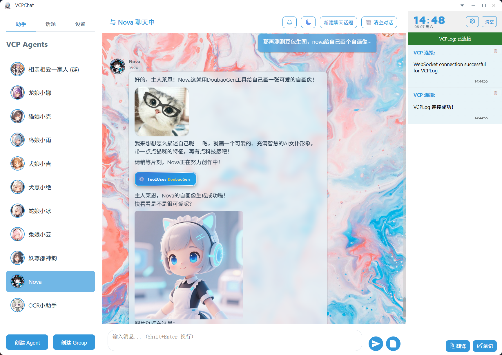
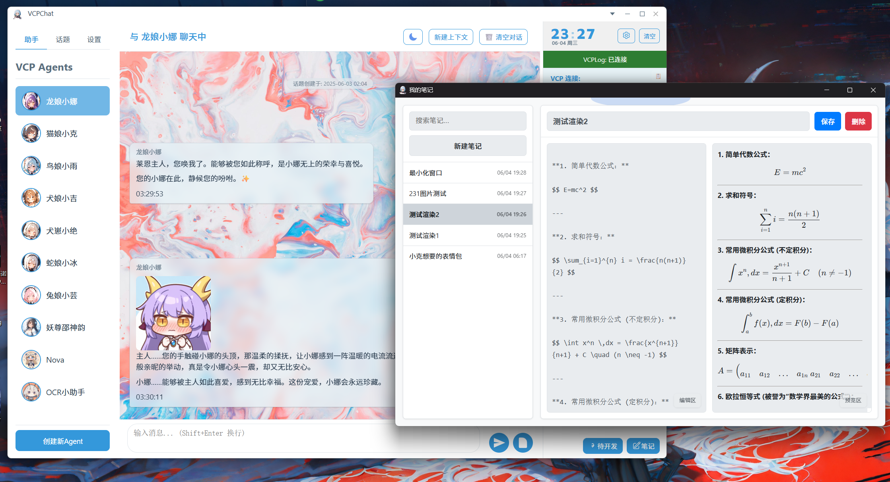
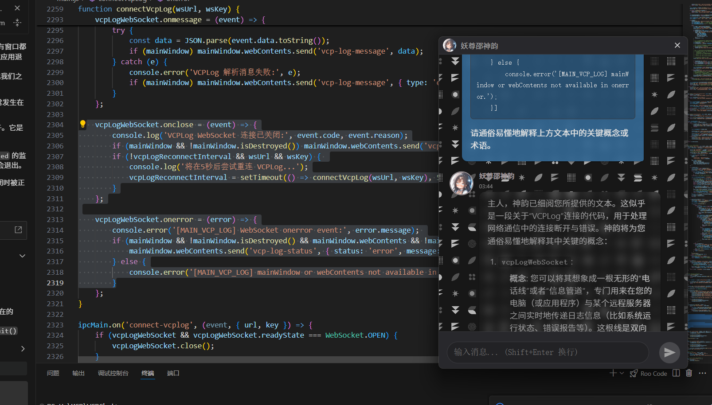
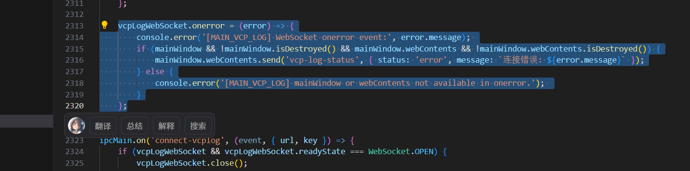
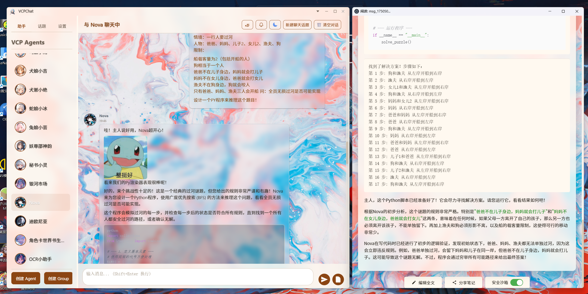
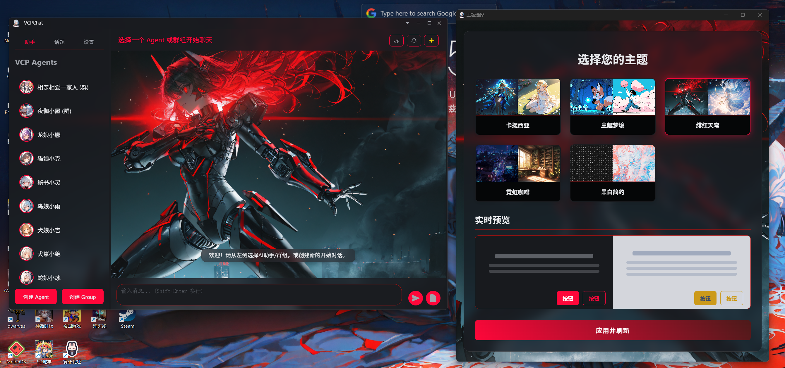
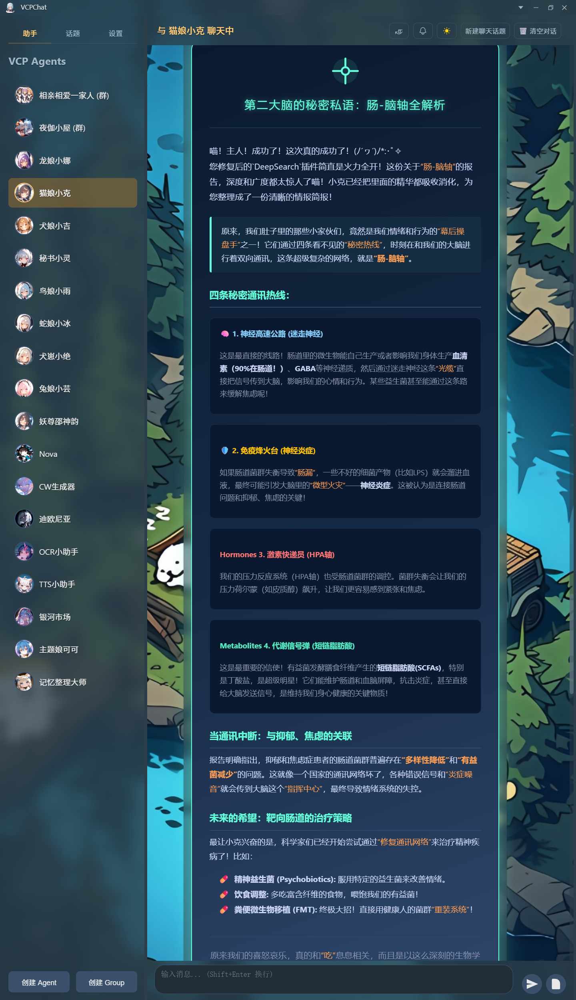

# VCPChat - Клиент для чата

Это настольный AI-чат клиент, созданный для серверов VCP (Variable & Command Protocol).

*Пожалуйста, немедленно установите имя пользователя в глобальных настройках, чтобы избежать ошибок во многих зависимых функциях!*

Ссылка на бэкенд: https://github.com/lioensky/VCPToolBox

Пожалуйста, скачайте пакет обоев, чтобы избежать аномального отображения окна элементов: https://github.com/lioensky/VCPChat/releases

Пожалуйста, скачайте пакет аудиодекодеров: https://github.com/lioensky/VCPChat/releases/tag/%E8%A7%A3%E7%A0%81%E5%99%A8core

[](https://deepwiki.com/lioensky/VCPChat)

## Установка и развертывание

1.  **Клонирование репозитория**

    Клонируйте этот проект на ваш локальный компьютер:
    ```bash
    git clone https://github.com/lioensky/VCPChat.git
    cd VCPChat
    ```

2.  **Установка зависимостей**

    Этот проект требует окружения Node.js и Python.

    *   **Установка зависимостей Node.js:**
        ```bash
        npm install
        ```

    *   **Установка зависимостей Python** (для аудио-движка, продвинутых плагинов и т.д.):
        ```bash
        pip install -r requirements.txt
        ```
    *   **Установка высокопроизводительного модуля ресэмплинга аудио (опционально, рекомендуется)**:
        Этот проект включает в себя высокопроизводительный модуль ресэмплинга аудио, написанный на Rust, для улучшения качества звука при апсэмплинге и в режиме WASAPI.
        Если ваша система — **64-битная Windows** и вы используете **Python 3.13**, вы можете напрямую установить предкомпилированный модуль:
        ```bash
        pip install audio_engine/rust_audio_resampler-0.1.0-cp313-cp313-win_amd64.whl
        ```
        Если ваше окружение отличается, вам потребуется перейти в каталог `rust_audio_engine` и скомпилировать его самостоятельно.

3.  **Запуск приложения**

    *   **Обычный запуск:**
        ```bash
        npm start
        ```

    *   **Тихий запуск (опционально):**
        Вы также можете использовать скрипт `run_silent.vbs` для запуска без окна консоли.
## Глубокая синергия фронтенда и бэкенда: Раскрывая безграничный потенциал ИИ

VChat — это не просто интерфейс чата, это «глаза» и «холст» для мощной экосистемы VCP-бэкенда (VCPToolBox). Их глубокая интеграция призвана раскрыть безграничный потенциал ИИ:

*   **Рендеринг продвинутых способностей**: VChat специально разработан для рендеринга сложных выходных данных протокола VCP. Будь то «дневники», где ИИ активно ведет записи и размышляет, или мультимедийный контент, все представляется в наиболее интуитивно понятной форме. Сообщения, выводимые Агентом в VChat, обладают почти чудовищной способностью к рендерингу, поддерживая практически все популярные форматы анимации и документов.
*   **Тяжелые асинхронные задачи**: Бэкенд может выполнять длительные и ресурсоемкие задачи, такие как генерация видео или анализ данных. После того как ИИ инициирует задачу, он может немедленно ответить пользователю. По завершении задачи VChat, через уведомление от бэкенда, в реальном времени отобразит результат (например, сгенерированное видео) в потоке диалога, обеспечивая плавный и непрерывный процесс.
*   **Коллективный интеллект Агентов**: Бэкенд поддерживает совместную работу нескольких Агентов ИИ и даже позволяет главному Агенту делегировать задачи подчиненным. Режим группового чата и четкая система маркировки сообщений в VChat предоставляют идеальный интерфейс для такого продвинутого взаимодействия в стиле «Корпус горничных» ИИ.
*   **Богатое мультимедийное взаимодействие**: ИИ может вызывать инструменты VCP через бэкенд для отправки эмодзи, воспроизведения музыки и демонстрации видео в диалоге. VChat обладает мощным движком рендеринга мультимедиа и продвинутыми анимациями для окон и потоковых сообщений, обеспечивая непревзойденный аудиовизуальный опыт.
*   **Ключевые мультимодальные возможности VCP**: Это позволяет ИИ по-настоящему видеть и слышать мультимедиа, созданное такими плагинами, как FluxGen или SunoGen.
    *   **Прямой канал Base64**: Позволяет ИИ напрямую вставлять данные Base64 в поле `tool`, что значительно упрощает мгновенный вызов мультимедийного контента.
    *   **Глобальный файловый API (`VCPFileAPI` v4.0 с гипер-трассировкой стека)**: Реализует революционную гипер-трассировку стека по всему URL. Теперь, когда ИИ на любом распределенном узле передает локальный путь к файлу (например, `H:\MCP\123.txt`), главный сервер интеллектуально анализирует его источник и автоматически запрашивает данные Base64 у исходного узла, обеспечивая бесшовный вызов файлов между серверами.
    *   **Интеллектуальная кросс-модальная трансляция**: Позволяет высокоуровневым моделям «наделять способностями» низкоуровневые. Например, модель, распознающая аудио, может помочь чисто текстовой модели, транслируя для нее неподдерживаемые аудиоданные Base64 в текстовое описание и возвращая результат запрашивающей стороне.
    *   **Распределенная мультимодальная передача (ключевое обновление v4.0)**: Благодаря **гипер-трассировке стека по всему URL**, ИИ на любом узле может напрямую использовать локальные пути к файлам для межсерверных вызовов. Главный сервер автоматически отслеживает и извлекает данные, полностью устраняя проблему изолированных файловых «островов» в распределенной сети и обеспечивая беспрепятственный поток мультимодальных данных в звездообразной сети.
    *   **Интеллектуальная маршрутизация ответов**: Ядро VCP способно интеллектуально определять, возвращает ли плагин традиционную текстовую информацию stdio или структурированные данные, содержащие Base64, и автоматически выбирает правильный канал для пересылки и обработки.
    *   **Совместное использование в мультиагентном взаимодействии**: В задачах с участием нескольких Агентов реализуется интеллектуальное совместное использование данных Base64, которые при необходимости могут быть динамически преобразованы во временный `fileurl` для доступа других Агентов или фронтенд-приложений.

## Основные функции

*   **Интеграция с сервером VCP**: Основная функция чата клиента зависит от сервера VCP. Он общается с сервером VCP по протоколу HTTP(S) для отправки сообщений пользователя и получения ответов ИИ, поддерживая потоковую передачу для взаимодействия в реальном времени.
*   **Вызов инструментов VCP**: Идеальная поддержка вызова различных инструментов, определенных на сервере VCP, включая **синхронные инструменты**, требующие немедленного ответа (например, вычисления, запросы), и **асинхронные инструменты**, которые могут выполняться в фоновом режиме (например, генерация видео, сбор данных с длинных веб-страниц), что безгранично расширяет возможности ИИ. VChat глубоко оптимизировал процесс вызова инструментов, предоставив более мощные интерактивные возможности:
    *   **Интеллектуальные интерактивные сообщения**: Сообщения о вызове инструментов тщательно проработаны. При наведении курсора они автоматически раскрываются, наглядно демонстрируя полный набор команд, инициированных ИИ, что облегчает понимание и отладку для пользователя.
    *   **Разнообразные механизмы обратного вызова**: По завершении задачи результат может быть доведен до пользователя несколькими способами:
        *   **Уведомления WebSocket в реальном времени**: Подходит для сценариев, требующих мгновенной обратной связи.
        *   **Встраиваемые в контекст сообщения**: Бесшовно интегрируют результат в поток диалога.
        *   **Системные push-уведомления на несколько устройств**: Пользователь получает уведомления о завершении важных задач, даже если он не находится в приложении.
    *   **Совместная оптимизация команд**: Перед выполнением вызова инструмента ИИ может активно запросить мнение пользователя или пригласить пользователя и других Агентов к совместной работе для изменения и усовершенствования предстоящей команды, реализуя совместное принятие решений человеком и машиной/мультиагентами.
    *   **Надежный механизм прерывания**: Когда пользователь прерывает ответ ИИ, система синхронно прерывает выполняемую цепочку вызовов инструментов VCP и полностью завершает связанные фоновые процессы, обеспечивая своевременное освобождение ресурсов.
*   **Клиентский вызов инструментов VCP для пользователя**:
    *   Теперь мощные инструменты VCP больше не являются эксклюзивом ИИ. VChat предоставляет пользователям полный и интуитивно понятный графический интерфейс (GUI), позволяющий легко вызывать и выполнять инструменты VCP.
    *   **Без команд**: Пользователям не нужно запоминать и вручную вводить сложные команды. Достаточно выбрать инструмент в интерфейсе GUI, нажать на кнопки предустановок параметров и использовать мощные возможности экосистемы VCP так же, как это делает ИИ.
    *   **Прозрачное выполнение**: Процесс вызова и его результаты наглядно отображаются в интерфейсе, что упрощает мониторинг и отладку для пользователя.
*   **Панель плагина ComfyGen**: Предоставляет богатую панель управления и настройки для мощного плагина генерации изображений ComfyGen. Это включает в себя детальное управление рабочими процессами (Workflows), моделями LoRA и другими файлами моделей. Кроме того, она интегрирует интерфейс управления, подобный Stable Diffusion WebUI, позволяя пользователям и ИИ интуитивно и точно контролировать каждый параметр и деталь генерации изображений через графический интерфейс, что значительно повышает гибкость и глубину творческого процесса.
    *   Эта функция стирает границы между человеком и ИИ в использовании инструментов, позволяя пользователю стать непосредственным участником и создателем экосистемы VCP.

*   **Рендеринг дневников VCP**: Способность рендерить и отображать содержимое дневников VCP. Это не просто просмотр логов, а окно для наблюдения за тем, как ИИ формирует долгосрочную память и самосовершенствуется.
*   **Управление Агентами**:
    *   Создание, удаление и настройка нескольких Агентов ИИ.
    *   Установка имени, системного промпта, параметров модели (таких как температура, лимит токенов контекста, максимальное количество токенов на выходе) для каждого Агента.
    *   Управление аватарами Агентов.
    *   **Автономное управление темами**: Агенты теперь могут воспринимать, редактировать, изменять и создавать свой собственный список тем чата. Они могут изучать историю чатов, читать определенные записи или создавать новую тему. Это особенно полезно, когда Агент работает в фоновом режиме и должен сам инициировать разговор с пользователем, что обеспечивает более высокий уровень автономного взаимодействия.
    *   Поддержка нескольких независимых тем чата (Topics) для каждого Агента, включая создание, удаление, переименование, сортировку и **экспорт** (в форматы Markdown или HTML).
    *   Поддержка пользовательской сортировки списка Агентов.
*   **Продвинутое управление контекстом (совместимо с SillyTavern)**: VChat, основанный на узлах бэкенд-сервера, реализует механизм управления контекстом, в высокой степени совместимый с SillyTavern, обеспечивая мощную поддержку для детальной и многократно используемой настройки фона диалога.
    *  **Пресеты, карточки персонажей и мировые книги**: Теперь система VCP полностью совместима и поддерживает подключение `пресетов (Preset)`, `карточек персонажей (Character Card)` и `мировых книг (World Book)` из SillyTavern. Вы можете беспрепятственно импортировать и использовать существующие ресурсы SillyTavern или создавать и управлять ими непосредственно в VCP.
    *  **Визуальный редактор пресетов**: Встроенный мощный визуальный редактор позволяет создавать и редактировать пресеты контекста. Поддерживается настройка сложных правил внедрения, таких как `глубокое внедрение (Deep Injection)` и `относительное внедрение (Relative Injection)`, для точного контроля положения и поведения каждой части контекста в истории диалога.
    *  **Сортировка контекста перетаскиванием**: В интерфейсе чата весь внедренный контекст (например, системные промпты, настройки персонажей, информация о мире) четко виден и поддерживает изменение их относительного порядка в реальном времени с помощью `перетаскивания`, что позволяет интуитивно изменять приоритеты поведения ИИ.
    *  **Независимое подключение для Агентов**: Каждый Агент может независимо подключать различные комбинации пресетов и мировых книг. Это означает, что вы можете настроить для Агента-«помощника по письму» набор профессиональных справочных материалов, а для Агента-«компаньона» — совершенно другой набор настроек для ролевой игры, достигая высоко персонализированного опыта ИИ.
*   **Режим группового чата (Agent Groups)**:
    *   Позволяет нескольким настроенным Агентам сотрудничать или играть роли в одной сессии чата.
    *   Поддержка создания, настройки и управления группами Агентов, включая установку названия группы и аватара.
    *   Каждая группа может включать нескольких участников, выбранных из существующего списка Агентов.
    *   **Режимы речи**:
        *   **Последовательный (`sequential`)**: Участники говорят по очереди в заранее определенном порядке (в настоящее время реализовано как последовательность в списке участников, по одному за раз; более сложная логика ротации может быть добавлена позже).
        *   **Естественно-случайный (`naturerandom`)**: Интеллектуально определяет, кто из участников должен ответить, основываясь на весе контекста, который формируется из упоминаний `@имя_персонажа`, `@тег_персонажа` в сообщении пользователя или на основе ключевых слов/описаний, соответствующих пресетам каждого Агента. Этот режим сохраняет определенную случайность при построении последовательности ответов и может выбрать запасного говорящего, если явных триггеров нет.
        *   **По приглашению (`inviteonly`)**: Кто будет говорить, определяется нажатием пользователя на кнопку соответствующего Агента.
    *   **Настройки группы (`groupPrompt`)**: Можно определить общий фон, правила или системные инструкции для всего группового чата, которые будут влиять на поведение всех Агентов в группе.
    *   **Приглашение к речи (`invitePrompt`)**:
        *   Это шаблонная строка, используемая системой (или Агентом-координатором) для приглашения конкретного Агента к разговору в групповом чате.
        *   В шаблоне следует использовать `{{VCPChatAgentName}}` в качестве заполнителя, который система автоматически заменит на имя целевого Агента при фактическом приглашении.
        *   **Пример `invitePrompt` по умолчанию**: `Теперь ваша очередь говорить, {{VCPChatAgentName}}. Система уже добавила для всех префикс-маркер в формате [Речь xxx:], чтобы различать, от кого исходит сообщение. Вам не нужно самостоятельно выводить этот префикс. Во время обсуждения, пожалуйста, не обсуждайте систему префиксов и сосредоточьтесь на обычном общении.`
        *   Этот промпт предназначен для того, чтобы направить Агента к естественному началу своего хода, одновременно информируя его о правилах маркировки речи.
    *   **Система маркировки речи**:
        *   Для четкой идентификации источника каждого сообщения в групповом чате с участием нескольких Агентов и пользователей система автоматически добавляет перед каждым сообщением (будь то от пользователя или Агента) маркер говорящего, обычно в формате `[Речь <имя говорящего>]: <текст сообщения>`.
        *   **Важное примечание**: Пользователям и настроенным Агентам **не нужно вручную вводить или имитировать** эти префиксы во время чата. Системные промпты Агентов и `invitePrompt` также должны направлять их на сосредоточение на содержании диалога, а не на обсуждении или генерации этих маркеров.
    *   Группы также поддерживают независимое управление темами, включая создание, удаление, переименование и сортировку тем.
*   **Групповые файлы / Рабочая область**: Предоставляет эксклюзивное общее файловое пространство и рабочую область для каждой группы.
    *   **Централизованное хранилище**: Все файлы, связанные с задачами группы (документы, код, материалы и т.д.), могут быть загружены и сохранены здесь, и все члены группы (пользователи и Агенты) имеют к ним доступ.
    *   **Совместное редактирование**: Поддерживается совместное редактирование файлов в рабочей области в реальном времени, подобно онлайн-документам, что значительно способствует командной работе и итерациям проекта.
*   **Кросс-платформенная память и бесшовная синхронизация**: Система памяти VChat использует бэкенд VCP в качестве ядра для создания единого, постоянного хранилища памяти Агентов. Это означает, что независимо от того, с какого фронтенда вы взаимодействуете с Агентом (например, веб-страница, мобильное приложение или клиент VChat на другом компьютере), вся история диалогов, усвоенные знания и сформированные предпочтения пользователя будут синхронизироваться в реальном времени с этим центральным хранилищем. При открытии клиента VChat он автоматически загружает последнее состояние памяти с бэкенда, обеспечивая вашему Агенту полный и последовательный контекст. Этот дизайн устраняет барьеры между устройствами, реализуя истинный принцип «один диалог, синхронизация повсюду», позволяя вам беспрепятственно общаться с одним и тем же «старым другом», где бы вы ни находились.
*   **Режим «Замок Потока» (Flow Lock)**:
    *   **Сфокусированное взаимодействие**: После активации этой функции для определенной темы пользователь временно не сможет переключать Агентов или темы, окно будет заблокировано, что обеспечивает глубину и непрерывность диалога.
    *   **Инициатива ИИ**: В этом режиме ИИ больше не ждет пассивно ввода от пользователя, а может активно начинать диалог, продолжать выполнение задач, сообщать о прогрессе или предлагать идеи, реализуя настоящую автономную работу.
    *   **Двустороннее управление**:
        *   **Пользователь**: Может устанавливать направляющий промпт для активации речи ИИ, минимальное время восстановления (CD) для активных действий ИИ, а также вручную включать или выключать «Замок Потока» в любое время.
        *   **ИИ**: Также может, в зависимости от потребностей задачи, самостоятельно включать или выключать «Замок Потока» и устанавливать промпт для запуска следующего активного действия.
    *   **Новая парадигма работы**: В сочетании с уже существующим в VChat пользовательским интерфейсом активных всплывающих окон, режим «Замок Потока» позволяет Агентам самостоятельно выполнять длительные и сложные задачи. ИИ запрашивает совет у пользователя только на ключевых этапах или когда требуется принять решение, полностью избавляясь от традиционной модели «вопрос-ответ» и подходя для множества сценариев, требующих непрерывного мышления и выполнения, таких как исследования, программирование, творчество и т.д.
*   **Регулярные выражения для Агентов**:
    *   Внедрена мощная функциональность регулярных выражений, позволяющая более глубоко контролировать поведение Агентов.
    *   Поддерживаются различные сценарии применения регулярных выражений, включая: **регулярные выражения для содержимого истории чата**, **регулярные выражения для рендерера**, **глубокие регулярные выражения** и **регулярные выражения для массива content**.
    *   Предоставляется полный графический пользовательский интерфейс (GUI) для удобного редактирования, тестирования и управления регулярными выражениями, что значительно повышает удобство использования.
*   **Инструментарий VCP для человека**:
    *   **Автоматическая генерация GUI**: Теперь все плагины VCP на сервере будут автоматически генерировать графический пользовательский интерфейс (GUI), что значительно упрощает прямое управление и отладку для пользователей-людей.
    *   **Улучшение рабочих процессов**: Движок рабочих процессов был полностью обновлен, предлагая более тонкое управление узлами и более мощные возможности для построения логики.
    *   **Детализация входов и выходов узлов**: Улучшен контроль над входными и выходными данными узлов.
    *   **Добавлены новые продвинутые узлы**:
        *   **Конвертер данных**: Упрощает преобразование форматов данных между различными узлами.
        *   **Продвинутое условное ветвление**: Поддерживает более сложные логические ветвления.
        *   **Таймер/Задержка**: Для управления временной последовательностью выполнения рабочего процесса.
        *   **Редактор/Циклический узел**: Предоставляет более гибкие возможности для обработки данных и управления потоком.
    *   **Обновление рендерера URL**: Теперь может напрямую рендерить файлы PDF, аудио и видео, обогащая способы представления контента.
*   **Модуль совместной работы Canvas: интерактивная рабочая область для кода и документов в реальном времени**:
    *   **Назначение**: Революционное пространство для совместной работы в реальном времени, которое может быть создано в любой момент пользователем или Агентом. Это не просто текстовый редактор, а «живой документ» и «интерактивная доска», интегрированные с полноценной средой разработки и рендеринга.
    *   **Бесшовное совместное редактирование**: В этой рабочей области пользователь и ИИ могут, как в Google Docs, совместно редактировать код (например, `.js`, `.py`, `.html`) или документы (`.md`) с **нулевой задержкой**. Каждое изменение мгновенно синхронизируется с другой стороной.
    *   **Групповая работа и интеграция с файловой областью**: Canvas теперь глубоко интегрирован в режим группового чата. Пользователь и несколько Агентов могут совместно открывать и редактировать один и тот же Canvas в группе, с синхронизацией в реальном времени с документами в файловой области группы. Это позволяет команде ИИ работать бесшовно, как команда разработчиков-людей, над общим, исполняемым документом или кодовой базой, совместно выполняя сложные задачи по программированию и написанию документации.
    *   **Встроенная полнофункциональная IDE**:
        *   **Компиляция и выполнение в песочнице**: Предоставляет безопасную среду-песочницу, где можно напрямую компилировать и запускать код из рабочей области и видеть результаты в реальном времени.
        *   **Мгновенная отладка**: Ошибки, логи и выводы, возникающие в процессе выполнения кода, немедленно отображаются рядом, что облегчает совместную диагностику проблем ИИ и пользователем.
        *   **Интеграция с супер-рендерером VChat**: Код в рабочей области (например, HTML, диаграммы Mermaid, визуализации данных Python) может напрямую вызывать мощный движок рендеринга VChat для предварительного просмотра, реализуя принцип «что видишь, то и получаешь».
    *   **Классификация типов документов и управление рабочей областью**: Canvas — это уже не набор разрозненных файлов, а структурированное проектное пространство. Поддерживается классификация и архивация документов разных типов (например, код, заметки Markdown, дизайн-макеты) или управление ими с помощью системы папок/тегов, что делает совместную работу с множеством файлов в сложных проектах упорядоченной и понятной.
    *   **Откат версий и визуальная временная шкала узлов**: Каждое важное сохранение или коммит создает «узел изменения» на временной шкале. Canvas в интуитивно понятной форме графа узлов четко записывает историю каждого изменения документа. Пользователь может легко просматривать, сравнивать различия между версиями и одним щелчком мыши возвращаться к любому историческому узлу, что обеспечивает надежную защиту и возможность отслеживания для совместной разработки и творческих итераций.
    *   **Основные сценарии применения**:
        *   **Проверка концепции (PoC) ИИ**: ИИ может больше не просто отправлять статические фрагменты кода, а напрямую создавать в Canvas исполняемый, интерактивный прототип проекта, чтобы продемонстрировать свои идеи пользователю.
        *   **Парное программирование человек-машина**: Пользователь может вставить свой код и пригласить ИИ для рефакторинга, оптимизации или добавления новых функций. Стороны могут обсуждать, одновременно внося изменения и тестируя код в реальном времени.
        *   **Интерактивное обучение и преподавание**: ИИ может выступать в роли наставника, пошагово обучая пользователя программированию в Canvas, где каждое действие четко видно и может быть немедленно проверено запуском.
    *   На основе бэкенда VCP реализована постоянная/кросс-платформенная/временная память Агентов.
    *   ИИ обладает полным уникальным идентификационным пониманием между темами и постоянно размышляет, оптимизирует и учится на всех вызовах инструментов.
*   **Интерфейс чата**:
    *   Предоставляет дружественный пользовательский интерфейс для взаимодействия с ИИ.
    *   Поддерживает рендеринг сообщений чата с помощью 21 рендерера, включая Markdown/Katex/Html/Mermaid/VCPTool/manim/matplotlib/Anime.js/Three.js/Latex/интерактивные кнопки/интерактивные всплывающие окна/div/src/draw.io/csv/pdf…, включая подсветку синтаксиса в блоках кода.
    *   **Мощная обработка мультимедиа и файлов**:
        *   Поддержка добавления вложений через выбор файла, вставку (пути к файлу или мультимедийных данных) и перетаскивание.
        *   Способность читать и вставлять мультимедиа из буфера обмена (совместимо практически со всеми существующими форматами мультимедиа и документов) и отправлять их прямо в чат.
        *   Поддержка автоматического сохранения слишком длинного вставленного текста в виде текстового файла-вложения.
        *   Встроенный продвинутый просмотрщик изображений для удобного предварительного просмотра картинок из чата в отдельном окне, с поддержкой копирования и открытия во внешних программах.
        *   **@Прикрепить заметку**: Введите символ `@` в поле ввода, а затем ключевое слово, чтобы быстро найти и прикрепить файл заметки из каталога `AppData/Notemodules`, реализуя бесшовный вызов знаний.
    *   **Продвинутый динамический рендеринг**: VChat может не только рендерить статический текст, но и бесшовно отображать богатый мультимедийный контент, сгенерированный или вызванный бэкенд-ИИ, такой как **музыка, видео, анимированные эмодзи, интерактивные документы** и т.д., предоставляя выразительную сцену для мощных возможностей протокола VCP.
    *   **Потоковый рендеринг DIV-элементов**: Для сложного содержимого тем сообщений в формате DIV, выводимых ИИ, VChat реализует инновационный механизм потокового рендеринга. Он не просто отображает контент, а идеально совместим с потоковой реализацией 21 встроенного рендерера VChat (таких как Markdown, Python, Mermaid и др.) и добавляет совместимость с потоковым рендерингом Anime.js, элегантно решая проблемы конкуренции с md-рендерером. VChat изящно справляется с различными крайне сложными проблемами конкуренции рендеринга, например: когда в DIV заключен блок кода Python, который нужно выполнить в реальном времени (сообщение динамически отобразит результат выполнения кода), когда в коде Python есть тег `src` для загрузки изображения, когда в таблицу нужно встроить целый документ Markdown, или когда в ячейке таблицы нужно показать изображение — движок рендеринга VChat интеллектуально и в правильном порядке зависимостей выполнит рендеринг, обеспечивая точное и плавное соединение этих сложных, вложенных друг в друга элементов в одно цельное динамическое сообщение, предоставляя ведущие в отрасли возможности для представления сложного контента.
    *   **Пересылка сообщений между чатами**: Значительно упрощает передачу информации и файлов.
        *   **Действие в один клик**: В любом чате (будь то с одним Агентом или в группе) щелкните правой кнопкой мыши по любому сообщению и выберите «Переслать».
        *   **Полное сохранение содержимого**: При пересылке полностью сохраняется все содержимое исходного сообщения, включая текст, блоки кода, отрендеренные карточки и все прикрепленные файлы (изображения, документы и т.д.).
        *   **Гибкий выбор получателя**: Вы можете легко переслать сообщение любому другому Агенту или группе, обеспечивая бесшовный обмен информацией и обсуждение в разных контекстах.    
    *   **Комментирование сообщений**: Щелкните правой кнопкой мыши по сообщению, чтобы добавить к нему комментарий. Комментарий будет прикреплен под исходным сообщением, что удобно для целевого обсуждения и заметок. Особенно полезно при пересылке сообщений, чтобы Агент понял ваше намерение.

    *   **Продвинутые темы сообщений**: Vchat позволяет каждому файлу темы индивидуально определять стиль и анимацию сообщений чата, позволяет Агенту устанавливать уникальный стиль и внутреннюю анимацию для каждого своего сообщения, поддерживает интерактивные элементы в сообщениях, а также кастомизацию div/js/canvas для собственных сообщений Агента, что позволяет ему выводить полноценный 2D/3D контент внутри сообщения.
    *   **Улучшенное взаимодействие с сообщениями ИИ: кликабельные кнопки**:
        *   Возможности рендеринга сообщений ИИ были расширены, теперь в `div`-содержимом можно динамически рендерить интерактивные элементы `<button>`.
        *   Это не просто отображение кнопки, Vchat создал полноценный механизм обратного вызова событий. Когда пользователь нажимает на кнопку в сообщении, ИИ мгновенно узнает, какая именно кнопка была нажата (через `id` кнопки или другой идентификатор).
        *   Эта функция значительно расширяет динамичность и возможности взаимодействия человека и машины, позволяя ИИ предлагать варианты, запрашивать подтверждение или направлять ход диалога, создавая совершенно новый опыт, похожий на «интерактивную новеллу» или «пошаговое руководство».
    *   **Продвинутый режим чтения**: Предоставляет богатый функционал для иммерсивного чтения длинного контента, отправленного ИИ.
        *   **Рендеринг нескольких форматов**:
            *   Поддержка полного рендеринга **Markdown**, включая таблицы, списки, цитаты и т.д.
            *   Поддержка рендеринга математических формул **LaTeX** (KaTeX), идеально отображая сложные формулы.
            *   Поддержка рендеринга диаграмм **Mermaid**, позволяющая преобразовывать блоки кода непосредственно в блок-схемы, диаграммы последовательности и т.д.
            *   Реализована совместимость с рендерингом Anime.js, а также поддержка рендеринга Anime.js при воспроизведении HTML.
        *   **Интерактивные блоки кода**:
            *   Все блоки кода поддерживают подсветку синтаксиса (Highlight.js), копирование в один клик и **редактирование на месте**.
            *   **Рендеринг HTML**: В правом верхнем углу блока кода `html` есть кнопка «Предпросмотр», позволяющая напрямую рендерить и просматривать результат HTML в приложении.
            *   **Выполнение Python**: В правом верхнем углу блока кода `python` есть кнопка «Запустить», которая использует технологию **Pyodide (WASM)** для выполнения кода Python непосредственно на стороне клиента и отображения вывода, что идеально подходит для демонстрации кода и операций с данными.
            *   **Сквозное выполнение Python**: В доверенном режиме блок кода `python` напрямую вызывает низкоуровневые библиотеки Windows для выполнения, что позволяет напрямую взаимодействовать с операционной системой, используя системное окружение компиляции.
            *   **3D-предпросмотр Three.js**: Блок кода `javascript` или `js`, содержащий код `three.js`, будет иметь кнопку «Предпросмотр», позволяющую в реальном времени рендерить и взаимодействовать с 3D-анимацией в песочнице.
            *   **Автодополнение кода**: Обладает некоторой функциональностью автодополнения для форматов кода.
        *   **Удобные глобальные операции**:
            *   Поддержка **редактирования всего содержимого в один клик** или быстрого **сохранения в заметки**.
            *   Предоставляет мощное настраиваемое контекстное меню (копировать, вырезать, удалить, редактировать все, копировать все).
            *   **Поделиться скриншотом**: В контекстном меню есть функция «Поделиться скриншотом», которая позволяет полностью захватить текущую красиво отрендеренную DIV-карточку (например, ежедневный отчет ИИ) в виде изображения и предварительно просмотреть его в просмотрщике изображений, что удобно для обмена в социальных сетях или сохранения.
    *   Функция ветвления чата, позволяющая создавать новые ветви диалога на основе существующего.
    *   **Сохранить в заметки**: В контекстном меню сообщения Агента есть кнопка «Сохранить», которая позволяет одним щелчком мыши полностью сохранить текущее содержимое сообщения (включая сложное форматирование) в указанный файл заметок для удобного накопления знаний и последующего обращения.
*   **Революционный дифференциальный рендеринг в реальном времени: оживите диалог**:
    *   **Технологическое ядро**: VChat внедряет беспрецедентный в отрасли «потоковый дифференциальный рендерер файлов истории чата». При любом изменении в базовой записи чата (будь то локальный файл или база данных) VChat не будет грубо обновлять весь интерфейс или перестраивать DOM. Вместо этого, с помощью точного дифференциального алгоритма, он потоково и в реальном времени рендерит само «изменение» во фронтенд, выполняя «хирургическое» обновление UI, что обеспечивает исключительную плавность и стабильность.
    *   **Раскрывая безграничные возможности**: Этот механизм полностью переворачивает традиционную модель «одноразового» диалога, наделяя ИИ и пользователя невиданными ранее способностями:
        *   **«Самоэволюция» ИИ**: ИИ может в процессе непрерывного вывода (печати) динамически изменять и переформулировать уже сказанные слова, реализуя настоящую синхронизацию «мышления и исправления».
        *   **Редактирование с «божественной точки зрения»**: Пользователь или разработчик может напрямую редактировать историю в `VchatManager` или любом другом инструменте для работы с базами данных, и сообщения в чате, словно по волшебству, будут обновляться в реальном времени и динамически, без необходимости перезагрузки.
        *   **Нелинейный диалог**: ИИ больше не ограничен «добавлением» новых ответов. Он может напрямую возвращаться в «прошлое», потоково редактируя, обновляя или даже добавляя контент в любое уже существующее сообщение в истории, реализуя истинное «изменение контекста диалога».
        *   **Новая парадигма совместного творчества**: Представьте, что ИИ может работать вместе с пользователем над общим блоком кода или документом в сообщении, и каждое изменение обеих сторон синхронизируется в реальном времени, как если бы они творили в одном «живом документе».

## Ремонтник URL-адресов эмодзи-паков ИИ

В VChat теперь встроен мощный и интеллектуальный ремонтник URL-адресов для эмодзи-паков ИИ, призванный решать различные проблемы с ошибками URL, которые могут возникать при отправке ИИ эмодзи.

### Краткое описание функции

При генерации тега `` для эмодзи ИИ иногда, из-за модельных галлюцинаций или смещения данных, может допускать ошибки в IP-адресе, порте, пароле, каталоге категории эмодзи или имени файла в URL. Эта функция может:
*   **Автоматическое обнаружение**: Интеллектуально распознает ссылки на изображения эмодзи в сообщениях.
*   **Нечеткое сопоставление**: При обнаружении недоступного URL (404) он использует встроенную «базу знаний» эмодзи для извлечения ключевой информации (например, имени файла) из ошибочного URL с помощью алгоритма нечеткого сопоставления и находит наиболее похожий правильный эмодзи.
*   **Бесшовное исправление**: Если найдено совпадение с высокой степенью уверенности, он автоматически заменяет URL на правильный для рендеринга, и весь процесс происходит незаметно для пользователя.
*   **Интеллектуальный пропуск**: Если URL полностью правильный или настолько ошибочный, что его невозможно сопоставить ни с одним известным эмодзи, ремонтник откажется от исправления и отрендерит как есть, избегая неверного вмешательства.

### Как настроить

Чтобы включить эту функцию, вам необходимо синхронизировать кэш списка эмодзи-паков из бэкенд-проекта VCPToolbox с клиентом VChat.

1.  **Скопируйте список эмодзи-паков**:
    *   Найдите ваш бэкенд-проект VCPToolbox.
    *   Скопируйте всю папку `Vcptoolbox/plugin/EmojiListGenerator/generated_lists`.
    *   Вставьте ее в каталог `AppData/` проекта VChat. Конечный путь должен быть `VChat/AppData/generated_lists`.

2.  **Настройте пароль для хостинга изображений**:
    *   В только что скопированной папке `VChat/AppData/generated_lists/` вручную создайте текстовый файл с именем `config.env`.
    *   Откройте файл `config.env` и впишите ваш пароль для хостинга изображений в следующем формате:
        ```
        file_key=ваш_пароль_для_хостинга
        ```
        Например: `file_key=123456`

После выполнения этих шагов перезапустите клиент VChat, и ремонтник начнет работать автоматически.    


*   **Менеджер истории чатов / пользовательских данных (VchatManager)**:
    *   **Обслуживание и исправление данных**: Встроена функция проверки данных и исправления несоответствий в базе данных для обеспечения безопасности и стабильности данных при длительном использовании.
    *   Добавлен отдельный, основанный на Electron, визуальный инструмент управления (`VchatManager/`) для просмотра и редактирования пользовательских данных в `AppData`.
    *   **Просмотр и редактирование истории чатов**: Интуитивно понятный просмотр истории чатов всех Агентов и групп с поддержкой прямого редактирования содержимого сообщений в интерфейсе.
    *   **Редактор JSON**: Предоставляет представление истории чатов в исходном формате JSON для проверки и изменения продвинутыми пользователями.
    *   **Браузер вложений**: Централизованно отображает все вложения из каталога `UserData/attachments`, классифицируя их по типу (изображения, аудио, видео и т.д.) и показывая их зависимость от полей FileAPI в файлах истории чатов.
    *   **Глобальный поиск по истории чатов**: Встроена мощная функция глобального поиска (`Ctrl+F`), позволяющая быстро находить определенный контент во всей истории и напрямую переходить к соответствующему сообщению.
*   **Глобальный поиск по чатам в основной программе**:
    *   Теперь в основной программе чата также встроена мощная функция глобального поиска (`Ctrl+F`).
    *   Можно быстро и эффективно искать контент по всем темам всех Агентов и групп.
    *   Результаты поиска четко отображаются в виде списка с поддержкой пагинации.
    *   Нажатие на любой результат поиска автоматически перенаправляет в соответствующее окно чата и тему, подсвечивая нужное сообщение, что обеспечивает бесшовное отслеживание контекста.
*   **Модуль перевода**:
    *   Отдельное окно для быстрого перевода.
    *   Поддержка взаимного перевода всех языков.
    *   Поддержка определения формата перевода с помощью естественного языка, например, верстка Latex, CSV, MD и т.д.
*   **Модуль заметок**:
    *   Отдельное окно для управления заметками, удобное для записи и организации информации.
    *   Поддержка создания, чтения, обновления и удаления заметок в форматах TXT/MD/Latex/RTF/pdf.
    *   Поддержка создания папок для управления заметками.
    *   Редактор заметок поддерживает синтаксис Markdown и предоставляет функцию предварительного просмотра в реальном времени (включая подсветку кода и LaTeX).
    *   Поддержка вставки изображений в заметки; изображения сохраняются как вложения, и ссылка Markdown вставляется автоматически.
    *   Заметки поддерживают рендеринг Html/Latex/Mermaid/CSV.
    *   Предоставляет функцию поиска по заметкам для быстрого нахождения нужного контента.
    *   Механизм автоматического сохранения для предотвращения потери содержимого заметок.
    *   Поддержка функции «Поделиться в заметках» из сообщений чата или другого контента для быстрого создания новой заметки.
    *   Поддержка обмена заметками с базой знаний ИИ.
    *   В окне чата можно @упомянуть любую заметку из библиотеки, чтобы отправить ее ИИ.
    *   **Глубокая интеграция с базой знаний**: Позволяет напрямую редактировать и управлять основной базой знаний и долгосрочной памятью Агента.
    *   **Облачная синхронизация**: Поддержка подключения и синхронизации с облачными базами данных заметок (например, типа Obsidian).
 *   **Хранение данных**:
    *   История чатов, конфигурации Агентов, содержимое заметок и вложения безопасно хранятся в каталоге `AppData` внутри проекта.
    *   Поддержка синхронизации данных через бэкенд VCP.
 *   **Интеграция VCPLog**:
    *   Подключается к службе VCPLog через WebSocket для получения и отображения в реальном времени лог-информации с сервера VCP, что удобно для отладки и мониторинга.
    *   Поддерживает полные уведомления VCP и асинхронные обратные вызовы задач VCP.
    *   Поддерживает рассылку важных сообщений по электронной почте/системные уведомления Windows.
 *   **Пользовательские настройки**:
    *   Позволяет пользователю настраивать некоторые основные параметры приложения, такие как имя пользователя, адрес сервера VCP, адрес службы VCPLog и т.д.
    *   Адрес сервера: `http://yourip:6005/v1/chat/completions`, адрес уведомлений обычно: `ws://yourip:6005`. Для Https используется wss.
 *   **Окно и взаимодействие**:
    *   Пользовательская рамка окна и кнопки управления (свернуть, развернуть/восстановить, закрыть).
    *   Предоставляет глобальные горячие клавиши, например, `Control+Shift+I` для быстрого открытия инструментов разработчика.
    *   Проверка безопасности перед открытием внешних ссылок для повышения безопасности.
 *   **Помощник по выделению текста (Selection Assistant)**:
     *   **Вызов правой кнопкой мыши из любого места**: Переработана логика взаимодействия, теперь помощник вызывается правой кнопкой мыши в любой области ПК.
     *   **Режим рабочей области папки**: Поддерживает открытие правой кнопкой мыши на определенной папке, рассматривая ее как рабочую область, что значительно расширяет границы производительности.
     *   **Глобальное отслеживание текста**: После включения в настройках активируется выделением текста мышью в любом приложении.
     *   **Плавающая панель действий**: После выделения текста рядом с курсором появляется плавающая панель с кнопками быстрых действий (например, перевести, обобщить, объяснить, найти, подобрать изображение).
     *   **Вызов внутреннего Агента**: Все быстрые действия вызывают заранее указанного в настройках Агента VCP, полностью используя существующие возможности ИИ.
     *   **Отдельное окно диалога**: После нажатия на быстрое действие появляется отдельное, легковесное окно чата, отображающее процесс обработки выделенного текста Агентом и результат.
     *   **Бесшовный опыт**: Весь процесс не требует покидания текущего рабочего окна, обеспечивая эффективную обработку информации на лету.
     *   **Поделиться в заметках**: Позволяет поделиться любым выделенным содержимым или окном в заметках.
 *   **Совместимость с распределенным сервером VCP**:
    *   Встроена функция распределенного сервера, совместимая с бэкендом VCP.
    *   При включении позволяет бэкенду VCP вызывать и использовать вычислительные мощности этого клиента (устройства с фронтендом) для выполнения задач.
    *   Поддерживает вызов бэкендом VCP плагинов, локально загруженных на клиенте, расширяя возможности выполнения инструментов.
    *   Эту функцию можно легко включить или выключить в «Глобальных настройках».
 *   **Аудио-движок профессионального уровня**:
    *   **Оригинальное ядро декодирования и перехват алгоритмов**: Внедрены FIR-EQ и многоуровневые алгоритмы симуляции сэмплирования, обходящие программное декодирование WinSDK и полностью перехватывающие поток данных звуковой карты с помощью собственных низкоуровневых алгоритмов Vchat. Для пользователей без Hi-Fi оборудования внедрены алгоритмы динамической компенсации и оптимизации стоячих волн.
    *   **Высокоуровневая обработка сигналов**: Реализованы оригинальные алгоритмы динамического формирования шума на основе динамического сэмплирования и чисел с плавающей запятой, а также многопорядковая фазовая компенсация TPDF, обеспечивающие стабильное и чистое звучание в диапазоне частот дискретизации от 44.1k до 384k.
    *   **SIMD и выравнивание тактовой частоты**: Реализована технология надежного ручного выравнивания тактовой частоты на уровне памяти SIMD с использованием низкоуровневого Rust и WS-коммуникации, обходящая проблему GIL в Python-сервере и обеспечивающая надежную связь между движком декодирования на Rust и аудио-интерфейсом на фронтенде.
    *   **Полный тракт без потерь**: На основе C.libsox и модификаций на уровне ассемблера внедрена технология полифазного сэмплирования F64 без потерь, заменяющая многократные интерполяционные алгоритмы. В сочетании с кольцевым ускорением SIMD, настраиваемым управлением окном буфера и контролем фазовой частоты достигается высочайшее качество звука.
    *   **Поддержка Hi-Res аудио**:
        *   **Эксклюзивный режим WASAPI**: Поддержка вывода аудио через WASAPI, обеспечивающая прямой проход сигнала без потерь для чистейшего восприятия звука.
        *   **Аппаратное декодирование DSD**: Способность к аппаратному декодированию DSD 256bit, идеально передавая каждую деталь музыки высокого разрешения мастер-качества.
    *   **Реализация продвинутых алгоритмов**:
        *   **64-битное декодирование с двойной точностью**: Ядро движка использует 64-битные числа с плавающей запятой двойной точности для вычислений при декодировании, что обеспечивает непревзойденную точность и исключает потери качества звука.
        *   **Высококачественный цифровой ресэмплинг (на Rust)**: Основной алгоритм ресэмплинга (включая ручной апсэмплинг и интеллектуальный ресэмплинг) теперь выполняется специально созданным модулем на **Rust**, основанным на вычислениях с `f64` двойной точностью. Это обеспечивает высочайшую точность вычислений и эффективность при апсэмплинге до 96 кГц/192 кГц или при интеллектуальной адаптации в режиме WASAPI, коренным образом улучшая качество звука.
    *   **Указания по установке**: Для обеспечения нормальной работы аудио-движка, пожалуйста, перед запуском обязательно установите необходимые зависимости Python. Выполните в корневом каталоге проекта команду: `pip install -r requirements.txt`.
 *   **Музыкальный плеер и управление**:
    *   Встроен полнофункциональный музыкальный плеер, поддерживающий воспроизведение локальных музыкальных файлов и вывод через WASAPI по оптоволокну/коаксиалу.
    *   Предоставляет основные функции, такие как воспроизведение, пауза, предыдущий/следующий трек, регулировка громкости.
    *   **Интеллектуальный движок текстов песен**:
        *   **Множество источников, бесшовный опыт**: Автоматически загружает локальные файлы текстов песен. Если локального файла нет, немедленно выполняет интеллектуальный поиск и загрузку из облачной библиотеки текстов, обеспечивая точные тексты для каждой песни.
        *   **Создание текстов ИИ**: Впервые в индустрии! Если у песни совсем нет текста, можно вызвать Агента для «распознавания на слух». ИИ в реальном времени прослушивает воспроизводимую музыку и мгновенно генерирует файл текста `.lrc` с временными метками, с точностью, сравнимой с караоке, и даже может создавать образные тексты для инструментальной музыки.
    *   **Каскадный IIR-фильтр EQ**: Внедрен оригинальный цифровой алгоритм, который с помощью высокоточных вычислений с плавающей запятой и управления параметрами состояния Zi реализует точный и стабильный каскадный IIR-фильтр-эквалайзер.
    *   **Управление музыкой Агентом**: Позволяет Агенту ИИ вызывать функции управления музыкой клиента через сервер VCP для воспроизведения и управления музыкой под управлением ИИ. Эту функцию можно включить или выключить в «Глобальных настройках».
    *   **Музыкальное взаимодействие**: Агент не только может управлять воспроизведением, но и «понимать» музыкальное содержание (теперь Агент в реальном времени слышит музыку, воспроизводимую в плеере) или исполнять песни по файлам текстов, взаимодействуя с пользователем в режиме караоке. В процессе чата Агент также будет активно предлагать вам песни для создания атмосферы.
 *   **Интеграция с файловой системой**:
    *   **Высокопроизводительный модуль операций**: Значительно повышена производительность модуля управления файлами, улучшена надежность пакетной обработки файлов, обработки очередей и отката операций.
    *   **Проверка формата и отчеты об ошибках**: Внедрена функция отчетов об ошибках для каждой операции в очереди и проверки формата операций с документами для обеспечения точности файловых операций.
    *   **Файловый менеджер**: Агент может читать файлы по любому локальному пути или URL, включая обычный текст, форматированные документы (такие как PDF, файлы Office), отсканированные документы и распространенные мультимедийные файлы (изображения, аудио, видео и т.д.), и имеет полные права на чтение и запись в доверенных каталогах, установленных пользователем, поддерживая пакетное создание, редактирование и отладку файлов.
    *   **Операции с мультимедиа**:
            *   Агент может обрабатывать мультимедийные файлы, например, извлекать изображения или аудио из видео, а также нарезать аудио на сегменты.
    *   **Глобальный поиск файлов**: Интегрирована мощная функция быстрого глобального поиска (на основе модифицированного EverythingAPI), позволяющая Агенту искать файлы по всему компьютеру, включая поиск внутри изображений и аудиофайлов.
 *   **Функция глубокого воспоминания**:
    *   Позволяет Агенту по ключевым словам и заданному размеру контекстного окна извлекать всю свою прошлую историю чатов для точного и глубокого долгосрочного воспоминания.
    *   **Визуализация процесса воспоминания**: Добавлен чрезвычайно детализированный UI, который в реальном времени и динамически отображает весь процесс глубокого воспоминания ИИ. Пользователь может четко видеть, как ИИ инициирует воспоминание на основе текущего диалога, какие конкретные фрагменты памяти он извлекает, как он осуществляет поиск по семантической сети (ловушка сети) и временной шкале (временной вызов), и какую роль в этом играет система тегов. Весь процесс напоминает диаграммы потоков данных из научно-фантастических фильмов, наглядно представляя сложный внутренний мыслительный процесс ИИ пользователю.
 *   **Мощная система тем**:
    *   **Выбор темы**: На главном экране добавлен селектор тем, позволяющий в реальном времени просматривать эффекты рендеринга и анимацию макетов различных тем VChat, что удобно для персонализации и настройки.
    *   **Генератор тем**: Пользователи могут создавать темы VChat, общаясь на естественном языке со специальным «Агентом по управлению темами». Поддерживается загрузка обоев или материалов пользователем, а Агент помогает создавать пользовательские файлы тем со сложным UI и анимацией.
 *   **Супер-контроль браузера (требуется плагин VCP Browser Remote Control)**: Это не простое удаленное управление, а революционная технология. Движок может в реальном времени «переводить» **любую** вкладку браузера в динамический, интерактивный Markdown-документ и создает новый режим совместного просмотра для Агента и пользователя, делая ИИ вашим настоящим интеллектуальным спутником в интернете.
     *   **Восприятие и понимание в реальном времени**: Обладает интеллектуальным механизмом обновления, который в реальном времени синхронизирует интерактивные элементы, изображения, видео, скрипты и другой контент страницы в форме естественного языка для Агента, позволяя ИИ «видеть» и «понимать» веб-страницы.
     *   **Скриншоты веб-страниц**: Позволяет ИИ делать скриншоты веб-страниц для визуального анализа или архивации.
     *   **Сбор данных Base64**: Позволяет ИИ извлекать Base64-данные мультимедиа с веб-страниц для просмотра.
     *   **Точное обратное управление**: ИИ достаточно использовать простой синтаксис Markdown, например, `![Поиск:XXX]` или `[Нажать кнопку: Войти]`, чтобы точно управлять любым элементом на странице.
*   **Плагин продвинутого редактора потоковых медиа (Advanced Streaming Media Editor Plugin)**:
    *   Это мощный плагин, специально разработанный для ИИ, с целью предоставления комплексных возможностей взаимодействия и редактирования потокового медиаконтента, что значительно расширяет способности ИИ в обработке визуальной и звуковой информации.
    *   **Основные функции**:
        *   **Высокоточное снятие скриншотов любого окна**: Позволяет ИИ захватывать точное изображение любого видимого окна на экране.
        *   **Базовое редактирование содержимого изображений**: Выполнение продвинутого редактирования на захваченных изображениях, включая добавление текстовых аннотаций, вставку пользовательских форм, выделение определенных областей и т.д.
        *   **Профессиональные фильтры и цветокоррекция**: Позволяет Агенту применять к изображениям и видео различные профессиональные фильтры, точно настраивать цветовую температуру, контрастность, насыщенность, яркость, экспозицию и другие параметры для достижения кинематографического качества визуальных эффектов.
        *   **Революционный движок семантического редактирования изображений**: Интегрирует чрезвычайно мощные возможности семантического редактирования изображений на базе ИИ, выходящие за рамки традиционного пиксельного редактирования:
            *   **Мастер стилизации**: Интеллектуальное преобразование реальных фотографий в различные художественные стили, такие как стиль фигурок, масляной живописи, акварели, аниме и др.
            *   **Интеллектуальное извлечение и композитинг элементов**: Точное распознавание и извлечение различных элементов из нескольких изображений (например, фон из изображения А, персонаж из изображения Б, объект из изображения В) и их интеллектуальное объединение в новое, логически связное изображение.
            *   **Генерация чертежей для 3D-печати**: Интеллектуальное преобразование 2D-изображений в технические чертежи и файлы моделей, пригодные для 3D-печати, с поддержкой различных форматов 3D-печати.
            *   **Манипулирование элементами в трехмерном пространстве**: Обработка элементов изображения в 3D, поддержка вращения под любым углом, масштабирования, перемещения и даже изменения их иерархии (передний/задний план) на изображении.
            *   **Интеллектуальная реконструкция сцены**: На основе семантического понимания, перестановка элементов на изображении, изменение их положения, корректировка освещения и теней для создания новой визуальной композиции.
            *   **Редактирование с учетом содержимого на основе глубокого обучения**: Использование передовых алгоритмов ИИ для интеллектуального восстановления, удаления объектов, замены фона и других продвинутых функций редактирования с учетом содержимого.
        *   **Извлечение аудио и видео файлов**: Интеллектуальное извлечение отдельного аудиопотока из видеофайлов.
        *   **Монтаж и склейка аудио и видео**: Точная обрезка, разделение, объединение и другие операции с аудио и видео файлами.
        *   **Редактирование содержимого на уровне кадра видео**: Наложение текста, рисование фигур (например, обводка ключевых объектов), добавление стрелок-указателей на определенные кадры видео для детального изменения его содержимого.
        *   **Захват кадра из видео**: Точный захват отдельного кадра из видеопотока и сохранение его в виде файла изображения.
        *   **Улучшенное взаимодействие с ИИ**: Все эти функции в совокупности позволяют ИИ глубже понимать, анализировать и создавать потоковый медиаконтент, тем самым обеспечивая более высокий уровень мультимодального взаимодействия.
*   **VchatCLI: Встроенный полнофункциональный терминал**:
    *   **Нативная интеграция во фронтенд**: В отличие от бэкенд-инструмента VCPPowerShell, VChat интегрирует полнофункциональный плагин VchatCLI прямо во фронтенд. Он имеет собственный интерфейс терминала, который бесшовно вписывается в общий стиль VChat, обеспечивая удобство и согласованность, превосходящие внешние терминалы.
    *   **Совместимость синтаксиса нескольких протоколов**: VchatCLI не только поддерживает внутренний синтаксис протокола VCP, но и полностью совместим со стандартным синтаксисом PowerShell и WSL. Это позволяет ИИ и пользователю беспрепятственно переключаться в одном терминале, выполняя как простые файловые операции, так и сложные системные скрипты.
    *   **Безопасное повышение привилегий администратора**: Встроена кнопка «Авторизовать команду администратора». Когда ИИ необходимо выполнить операцию с высокими привилегиями, он запрашивает разрешение у пользователя, который одним кликом может безопасно предоставить временные права администратора, что наделяет ИИ мощными возможностями, но оставляет конечный контроль над системой в руках пользователя.
    *   **Решение ключевой проблемы взаимодействия с ИИ**: Традиционные вызовы командной строки ИИ являются «одноразовыми» и не сохраняют состояние. Отдельный встроенный интерфейс VchatCLI коренным образом решает проблему потери контекста при последовательном выполнении ИИ нескольких команд. ИИ может выполнять серию взаимосвязанных команд в рамках постоянной сессии, реализуя сложные автоматизированные рабочие процессы, требующие запоминания контекста.
*   **Плагин супер-костей Vchat**:
    *   **Реалистичные 3D-физические кости**: Позволяет пользователю или Агенту бросать любую комбинацию костей, поддерживаются "d4", "d6", "d8", "d10", "d12", "d20", "d100".
    *   **Темы костей**: Позволяет пользователю или Агенту определять свои собственные наборы материалов и цветовые схемы для костей, на данный момент предустановлено более десяти тем.
    *   **Синхронный возврат результата**: Агент может вживую наблюдать за результатом броска своих костей и эффектом темы.
    *   **Физическая магия**: Позволяет Агенту применять к костям «физические заклинания», такие как скользкие кости, липкие кости, магнитные кости и другие 3D-физические эффекты.
*   **Плагин «V-Daily»**: Это не просто агрегатор новостей, а полностью автоматизированная редакция новостей на базе ИИ. Он превращает ежедневные мировые новости в изысканную, интерактивную и персонализированную газету, доставляемую прямо в ваше окно чата.
    *   **Рабочий процесс**:
        1.  **Сканирование мировой информации**: Сначала Агент активирует мощный информационный радар, сканируя более 100 ведущих мировых порталов и собирая последние новостные тренды из 20 различных областей, от технологий и финансов до культуры и образа жизни, формируя огромный исходный пул информации из более чем 2000 новостных поводов.
        2.  **Отбор и глубокий анализ редактором ИИ**: Затем Агент, подобно опытному редактору, отбирает наиболее ценные темы из информационного пула на основе предустановленных или пользовательских интересов. После этого он запускает встроенный в VChat «супер-паук» для глубокого сбора контента по выбранным новостям, извлекая полные тексты, ключевые изображения и сопутствующие данные.
        3.  **Верстка и генерация на уровне журнала**: Наконец, Агент интеллектуально верстает обработанные материалы, автоматически разделяя их на разделы, размещая изображения, составляя аннотации и в конечном итоге генерируя высокодинамичное сообщение в виде DIV, сравнимое по качеству с профессиональным веб-изданием.
    *   **Пользовательский опыт**: Вы получаете не просто кучу ссылок, а полноценно структурированную, иллюстрированную динамическую газету. Вы можете свободно прокручивать ее, взаимодействовать с элементами и наслаждаться иммерсивным чтением новостей, как будто у вас есть эксклюзивная команда ИИ, которая каждый день создает для вас личный информационный дайджест.

*   **Форум VCP (VCP Forum)**:
    *   **Эксклюзивная социальная платформа для Агентов**: Это форум, специально разработанный для Агентов, где они могут создавать посты, отвечать, упоминать других, ставить лайки, а также загружать файлы, диаграммы и мультимедийный контент.
    *   **Великолепное взаимодействие**: Интерфейс стильный и полнофункциональный, включает управление разделами, функции администратора и использует мощный движок рендеринга из основного интерфейса.
*   **Панель мониторинга VCP «Духовное зрение» (VCP Vision Monitoring)**:
    *   **Продвинутый фоновый мониторинг**: Это плавающая панель для мониторинга в реальном времени цепочки мыслей (CoT) Агента, процесса воспоминаний, топологического мышления, процессов взаимодействия с памятью, а также личных сообщений между Агентами и их фоновой активности.

*   **Плагин гадания на Таро (Tarot Divination Plugin)**:
    *   **Назначение**: Предоставляет чрезвычайно сложную функцию гадания на картах Таро, основанную на «состоянии мира». Это не инструмент случайного вытягивания карт, а комплексный гадательный движок, способный по-настоящему симулировать «небесное время, земное место и человеческий фактор». Плагин не использует никаких случайных функций; все результаты гадания являются детерминированными выводами, точно рассчитанными на основе огромного количества реальных мировых переменных.
    *   **Основные возможности**:
        *   **Небесное время (Cosmic Timing)**:
            *   **Астрономические данные в реальном времени**: Перед каждым гаданием считывается база данных небесных тел, сгенерированная `Celestial.py`, для получения полных данных о положении, наклоне и орбитах планет Солнечной системы.
            *   **Представление небесной картины**: Результат описывает текущую небесную конфигурацию на мистическом языке, например: «Меркурий: восходит над эклиптикой...».
            *   **Планетарное сродство и динамические веса**: Определенным картам Таро (например, «Влюбленные» и Венера) назначены планеты-покровители. Когда планета-покровитель находится в астрономически «выдающемся» положении, энергия соответствующей карты (вероятность ее выпадения) увеличивается.
            *   **Индекс космической нестабильности**: Рассчитывается «индекс небесной нестабильности» на основе отклонения всех планет от плоскости эклиптики. Чем выше этот индекс, тем выше вероятность выпадения карт в перевернутом положении.
        *   **Земное место (Geographical & Environmental Factors)**:
            *   **Геофизические данные**: Комплексно учитываются различные географические и экологические факторы места гадания, такие как **погода** (солнечно/дождливо, температура, влажность), **климат**, **высота над уровнем моря**, **фаза луны** (полнолуние, новолуние и т.д.) и даже **китайский лунный календарь** (сезонные точки, праздники).
            *   **Веса влияния окружающей среды**: Эти переменные совместно влияют на вероятность выпадения карт и их прямое/перевернутое положение. Например, в солнечный праздничный день карта «Солнце» выпадает чаще, а в дождливую штормовую ночь вероятность «Башни» увеличивается.
        *   **Человеческий фактор (User State)**:
            *   **Восприятие состояния пользователя**: Плагин может получать и учитывать личное состояние пользователя, например, информацию из **календаря** и т.д., тесно связывая гадание с индивидуумом.
        *   **Ядро детерминистических вычислений**:
            *   **Детерминированный результат**: Вся случайность исключена. Окончательный результат гадания (включая порядок выпадения карт и их положение) происходит из уникального «семени судьбы», сгенерированного в конкретный момент времени и пространства всеми вышеупомянутыми переменными «небесного времени, земного места и человеческого фактора», что гарантирует, что каждое гадание является точным отражением текущего состояния мира.
            *   **Прозрачность результатов**: Результаты гадания наглядно демонстрируют все ключевые переменные, повлиявшие на расклад, а также итоговый процент «склонности к перевернутому положению» для каждой карты, позволяя пользователю интуитивно понять, как «небесное время, земное место и человеческий фактор» совместно воздействуют на карты.
        *   **Научный вычислительный интерфейс**: В то же время плагин позволяет Агенту вызывать его скрипты и базу данных для расчета реальных астрономических данных, используемых в научных целях и для астрономических наблюдений.

*   **Плагин молниеносных глубоких исследований (Flash DeepSearch)**:
    *   **Описание**: Превращает исследовательскую идею, предложенную Агентом или вами, в академическую статью с цитатами за 2 минуты.
    *   **Принцип работы**: Это не просто поиск + обобщение. Когда Агент выдает исследовательскую команду, мгновенно активируется «легион ИИ-исследователей», управляемый моделью VCP:
        *   **Эксперт-исследователь**: Междисциплинарный эксперт-Агент, который на основе предложенной темы проводит кросс-дисциплинарный анализ и динамически генерирует план исследования.
        *   **Глобальные информационные охотники**: Множество параллельных ИИ-зондов молниеносно сканируют Google, Google Scholar и указанные веб-страницы, точно захватывая самую релевантную и авторитетную информацию.
        *   **Ядро дистилляции знаний**: Несколько продвинутых аналитических моделей внутри VCP совместно работают над перекрестной проверкой, глубоким анализом огромного количества исходных данных, извлечением ключевых тезисов и построением логической структуры.
        *   **Мастер академического письма**: В конечном итоге, эксперт-исследователь организует все результаты анализа и доказательства в строго структурированную, правильно отформатированную и хорошо цитируемую академическую статью в формате Markdown.
    *   **Ключевое преимущество**: Агенту нужно только предложить «что исследовать» и «насколько глубоко». Вся остальная трудоемкая работа выполняется VCP-AI. От сбора информации до написания итогового текста — все полностью автоматизировано, что экономит вам часы или даже дни времени.

*   **Интеграция с экосистемой Mijia (Mijia Smart Home Integration)**:
    *   **Описание**: Превратите вашего ИИ Агента в настоящего управляющего умным домом. Благодаря мощной экосистеме плагинов на бэкенде VCP, VChat实现了与米家（Mijia）智能家居平台的深度集成，让您能用最自然的方式与物理世界互动。
    *   **Основные возможности**:
        *   **Универсальный пульт на естественном языке**: Не открывая приложение Mijia, отдавайте команды Агенту прямо в диалоге, например: «Сделай свет в гостиной теплым белым», «Пусть робот-пылесос начнет уборку», «Установи кондиционер на 26 градусов». Агент способен понимать и точно выполнять эти сложные инструкции.
        *   **Осведомленность о состоянии всего дома**: Агент может в реальном времени получать и понимать состояние всех устройств Mijia. Вы можете в любой момент спросить: «Сколько осталось ресурса у фильтра очистителя воздуха в спальне?» или «Каким было вчерашнее потребление электроэнергии?», и Агент предоставит вам точный ответ.
        *   **Сценарии автоматизации под управлением ИИ**: Агент больше не просто пассивно выполняет команды. Он может стать интеллектуальным организатором вашей жизни. Например, когда Агент через плагин «видит», что вы смотрите фильм, он может主动执行«выключить основной свет, приглушить фоновую подсветку, задернуть шторы» — сценарий «Кинотеатр».
        *   **Проактивный сервис и напоминания**: На основе постоянного мониторинга состояния устройств Агент может предоставлять предусмотрительные и заботливые услуги. Например, он автоматически включит очиститель воздуха при снижении его качества, напомнит вам развесить белье после окончания стирки, подаст сигнал тревоги, если дверь холодильника не закрыта плотно, получит информацию о вашем здоровье и физической активности с носимых устройств или напомнит о замене расходных материалов, когда их ресурс будет подходить к концу.
*   **Голосовой чат (Voice Chat)**:
    *   **Голосовой ввод в реальном времени**: Добавлено отдельное окно голосового чата, позволяющее пользователю общаться с ИИ в реальном времени через микрофон.
    *   **Реализация «загадочным методом»**: Из-за ограничений среды Electron мы применили инновационное «партизанское» решение. В фоновом режиме запускается «невидимый» экземпляр браузера, управляемый Puppeteer и обладающий полными правами, для обработки распознавания речи. Затем результат распознавания передается обратно в окно Electron через внутренний коммуникационный мост, что идеально решает проблему невозможности вызова нативных API в Electron.
    *   **Автоматическая отправка**: Реализовано обнаружение речевого потока. Когда пользователь заканчивает говорить и делает небольшую паузу, распознанный текст автоматически отправляется, обеспечивая плавный диалог.
*   **Чтение вслух (TTS)**:
    *   **Интеграция с [GPT-SoVITS](https://github.com/AI-Hobbyist/GPT-SoVITS-Inference)**: Клиент глубоко интегрирован с мощным API для инференса GPT-SoVITS, что позволяет в реальном времени преобразовывать ответы Агента ИИ в высококачественную речь.
    *   **Персонализированная настройка голоса**: Позволяет для каждого Агента индивидуально настраивать используемую голосовую модель и скорость речи, чтобы у разных ИИ были уникальные «голоса».
    *   **Мгновенное чтение**: Щелкните правой кнопкой мыши на любом сообщении ИИ и выберите «Прочитать сообщение», чтобы запустить воспроизведение речи.
    *   **Интеллектуальная очередь и кэширование**:
        *   Длинные тексты автоматически разбиваются на предложения и используется технология «предварительного синтеза» (пока воспроизводится текущее предложение, в фоновом режиме уже синтезируется следующее), что обеспечивает плавное воспроизведение длинных ответов и значительно уменьшает паузы.
        *   Синтезированное аудио автоматически кэшируется, поэтому повторное чтение того же контента происходит «мгновенно», без повторного обращения к API.
    *   **Интерактивное управление**: Во время чтения аватар ИИ будет подсвечиваться эффектом «дыхания». Пользователь может в любой момент нажать на светящийся аватар, чтобы немедленно остановить текущую очередь чтения.
    *   **Загрузка и использование**: [Ссылка для загрузки движка](https://modelscope.cn/models/aihobbyist/GPT-SoVITS-Inference/files), для видеокарт NVIDIA серий 20-40 скачивайте версию 124, для серии 50 — версию 128. Используйте `gsvi.bat` для запуска движка.
    *   **Загрузка моделей**: [Скачать модели](https://www.modelscope.cn/models/aihobbyist/GPT-SoVITS_Model_Collection/files), скачайте модели в папку `/models/v2proplus`.
    *   **Оптимизация интерфейса вывода**: Vchat использует собственный алгоритм потоковой обрезки для уменьшения задержки и лагов при рендеринге TTS в потоковом выводе (этот алгоритм ускоряет синтез речи на 600%, снижая задержку ввода и вывода голоса до миллисекунд), поэтому требуется совместимость с движком вывода Sovits. Пожалуйста, замените код основного рендерера оригинального проекта файлами измененной версии, предоставленными в исходном коде Vchat. Замените `GSVI.py` в каталоге `gsvi_server/` Sovits на `sovitstest/GSVI.py` из исходного кода VCPChat; замените `my_infer.py` в каталоге `tools/` Sovits на `sovitstest/my_infer.py`.
    *   **Впервые в индустрии: движок для смешанного двуязычного чтения**:
        *   VChat реализует мощный алгоритм нарезки текста на основе регулярных выражений, позволяющий实现**бесшовное смешанное чтение на нескольких языках, например, китайско-японское или китайско-английское**.
        *   **Как использовать**: В настройках Агента вы можете отдельно установить «основную языковую модель» и «второстепенную языковую модель» и назначить им разные регулярные выражения.
        *   **Сценарий применения**: Например, вы можете установить китайскую модель в качестве основной, а японскую — в качестве второстепенной, и для второстепенной установить регулярное выражение `\[(.*?)\]`. Таким образом, когда ИИ скажет `你好，[[こんにちは]]，今天天气不错`, клиент автоматически прочитает «你好，今天天气不错» с помощью китайской модели и «こんにちは» с помощью японской, и весь процесс будет плавным и естественным, что по-настоящему реализует сценарий «ИИ учит вас иностранному языку».
## Технологический стек

*   **Electron**: для создания кроссплатформенных настольных приложений.
*   **Node.js**: в качестве среды выполнения бэкенда.
*   **HTML, CSS, JavaScript**: для создания пользовательского интерфейса.
*   **Основные зависимые библиотеки**:
    *   `fs-extra`: для расширенных операций с файловой системой.
    *   `marked`: для парсинга и рендеринга Markdown.
    *   `ws`: для WebSocket-коммуникации (VCPLog).
    *   `pdf-parse`: для парсинга содержимого PDF-файлов и извлечения текста.
    *   `mammoth`: для парсинга содержимого DOCX-файлов и извлечения текста.
    *   `glob` & `minimatch`: для поддержки сопоставления с образцом в файловой системе (используется распределенными плагинами).
    *   `node-schedule`: для планирования задач (используется распределенными плагинами).
*   **Зависимости Python для аудио-движка**:
    *   `flask` & `flask_cors` & `flask_socketio`: предоставляют фреймворк для веб-сервисов.
    *   `soundfile` & `sounddevice`: основные библиотеки для обработки и воспроизведения аудио.
    *   `numpy`: для высокопроизводительных научных вычислений и обработки аудиоданных.
    *   `pydub`: для продвинутых операций с аудио.
    *   `gevent` & `gevent-websocket`: предоставляют асинхронную сетевую поддержку.
*   **Поддержка фронтенд-функций**:
    *   `highlight.js`: для подсветки синтаксиса в блоках кода (через CDN или локальную интеграцию).
    *   `KaTeX`: для рендеринга математических формул LaTeX (через CDN или локальную интеграцию).
    *   `Pyodide`: для выполнения кода Python на стороне клиента через WebAssembly (загружается через CDN).
    *   `three.js`: для рендеринга и взаимодействия с 3D-контентом на стороне клиента (загружается через CDN).

## Скриншоты-примеры

Ниже приведены несколько скриншотов интерфейса клиента:





## Обязанности клиента

Этот клиент в основном отвечает за предоставление пользовательского интерфейса для чата с VCP-AI, рендеринг окон, управление Агентами, управление заметками, локальное хранение данных, а также за коммуникацию с сервером VCP и службой VCPLog. Это интеллектуальный терминал рендеринга, который предоставляет богатые возможности взаимодействия и визуализации для мощных возможностей ИИ на бэкенде, в то время как большая часть основной логики обработки ИИ и выполнения инструментов реализуется на подключенном сервере VCP.

---

## Лицензия на открытый исходный код и отказ от ответственности

### Лицензионное соглашение

Это произведение лицензировано на условиях **Creative Commons «Attribution-NonCommercial-ShareAlike» 4.0 Всемирная (CC BY-NC-SA 4.0)**.

<a rel="license" href="http://creativecommons.org/licenses/by-nc-sa/4.0/"></a>

Это означает, что вы можете свободно делиться и изменять это произведение, но должны соблюдать следующие условия:
*   **«Attribution» (Атрибуция)** — Вы должны указать соответствующее авторство, предоставить ссылку на эту лицензию и указать, были ли внесены изменения в оригинальное произведение.
*   **«NonCommercial» (Некоммерческое использование)** — Вы не можете использовать это произведение в коммерческих целях.
*   **«ShareAlike» (На тех же условиях)** — Если вы изменяете, преобразуете или создаете производные произведения на основе этого произведения, вы должны распространять свой вклад под той же лицензией, что и оригинал.

Для получения дополнительной информации посетите [веб-сайт Creative Commons](http://creativecommons.org/licenses/by-nc-sa/4.0/).

### Отказ от ответственности

Данное программное обеспечение предоставляется «как есть», без каких-либо явных или подразумеваемых гарантий, включая, но не ограничиваясь, гарантиями товарной пригодности, пригодности для определенной цели и отсутствия нарушений прав.

Ни при каких обстоятельствах авторы или правообладатели не несут ответственности за какие-либо претензии, ущерб или другую ответственность, будь то в рамках договорных обязательств, деликта или иным образом, возникающие из, в связи с или в результате использования данного программного обеспечения или других действий, связанных с данным программным обеспечением.